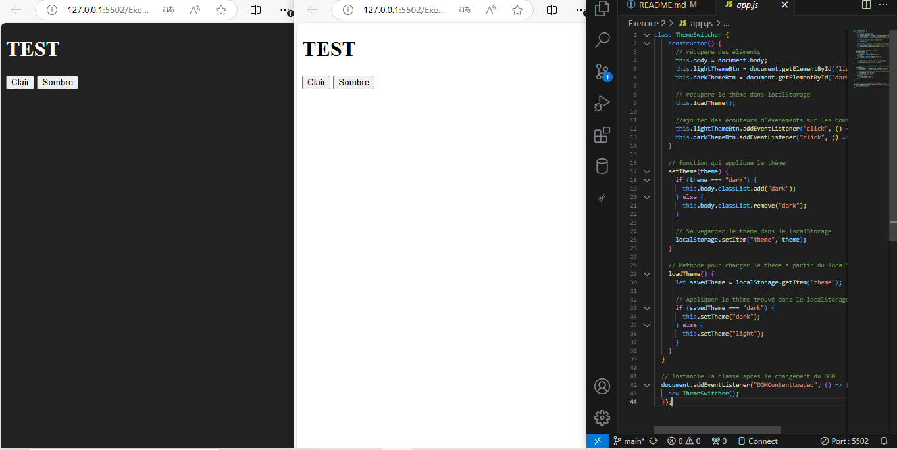

# Examen java script - sarah debiani 

Dans le cadre de mon examen JavaScript pour Human Booster
## Exercice 1 - Formulaire d'inscription 
### Ce que j'ai réalisé: 

J'ai créé un formulaire d'inscription complet, connecté à une API utilisant le système d'authentification JWT. Ce formulaire permet aux utilisateurs de s'inscrire en saisissant leur adresse email et leur mot de passe, avec une validation des champs en JavaScript avant l'envoi à l'API.
## Détails techniques: 
+ Page : register.html
+ Champs du formulaire :
 1. Adresse email 
 2. Mot de passe(avec une vérification pour un minimum de 8 caractères)
 3. Confirmation du mot de passe 
 + Validation: 
 1. Tous les champs sont obligatoires.
 2. Le mot de passe et sa confirmation doivent être identiques, sinon un message d'erreur stylisé s'affiche. 
 + Envoi du formulaire : 
 1. Une fois la validation réussie, les données sont envoyées en méthode POST à l'API via une requête JavaScript.
 2. Pendant le traitement de la requête, j'ai intégré un spinner pour indiquer à l'utilisateur que l'opération est en cours.
 3. Si l'inscription est réussie, l'API renvoie un code 201, et un message de confirmation s'affiche à l'utilisateur dans l'interface. 
 ## Technologies utilisées 
 + HTML/CSS : Pour la structure et le style du formulaire.
 + Bootstrap : Utilisé pour styliser le formulaire et intégrer le spinner de chargement.
 + JavaScript : Pour la validation des champs du formulaire et la gestion de la requête API. 

## Exercice 2 - Theme Switcher 
### Ce que j'ai réalisé: 

J'ai créé une classe JavaScript, nommée ThemeSwitcher, qui permet de basculer entre un thème clair et un thème sombre dans une page web. Cette fonctionnalité est persistante grâce à l'utilisation du localStorage pour sauvegarder le thème sélectionné.
## Détails techniques: 
+ Page : darklight.html 
+ Fonctionnalités : 
 1. Deux boutons permettent de changer le thème (clair ou sombre). 
 2. Le thème sélectionné est sauvegardé dans le localStorage, ce qui permet de le restaurer lors des visites suivantes. 
 3. Si aucun thème n'est sauvegardé, la page s'affiche par défaut avec le thème clair. 
 ## Technologies utilisées 
 + JavaScript : Gestion du changement de thème et sauvegarde dans le localStorage via la classe ThemeSwitcher. 
 + CSS : Pour styliser les thèmes sombre et clair. 
